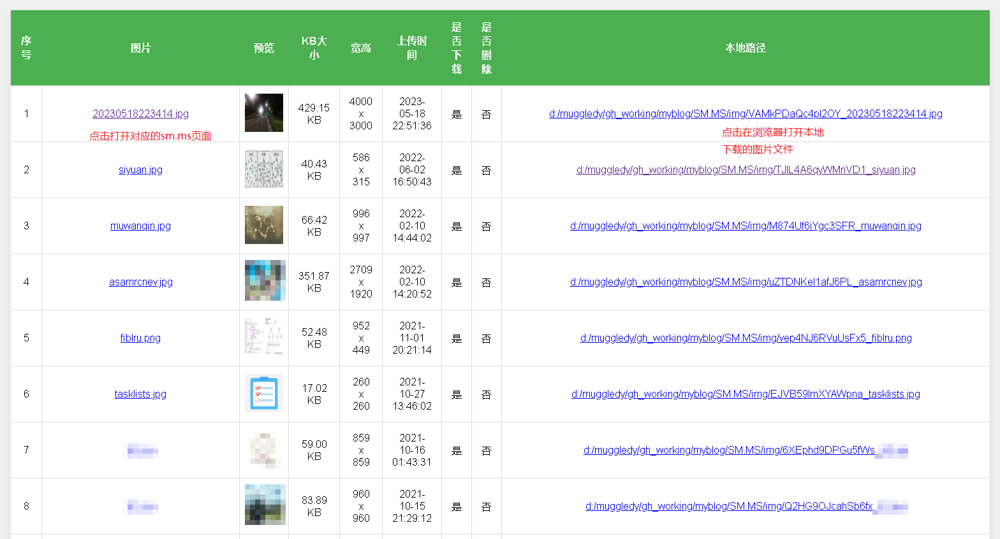

下载SM.MS个人图片资源列表：
1. 配置user_config.yaml用户名和密码
2. 执行`python download_images.py`

图片资源会导出在export.html中：

环境：
1. Python3.6+
2. Chrome + [ChromeDriver](https://chromedriver.chromium.org/downloads)
3. pip安装selenium、requests、PyYaml

参考：[SM.MS图片资源下载](https://muggledy.top/posts/43947/index.html)